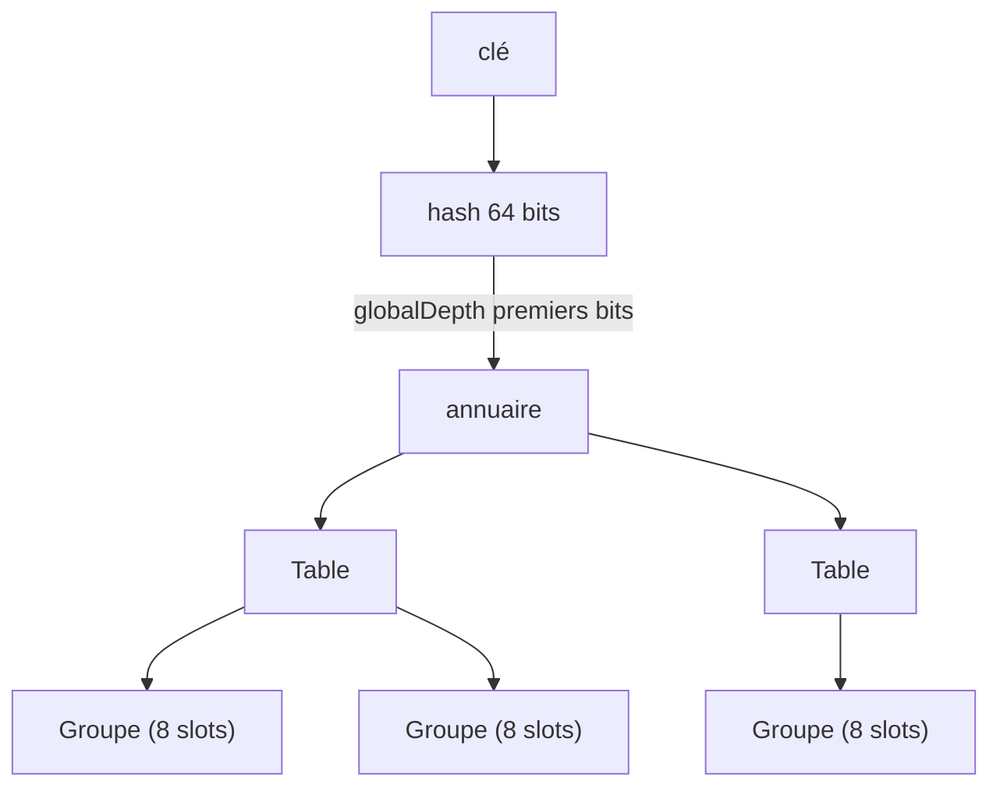
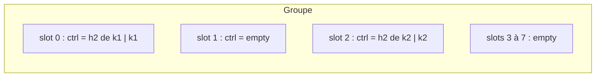
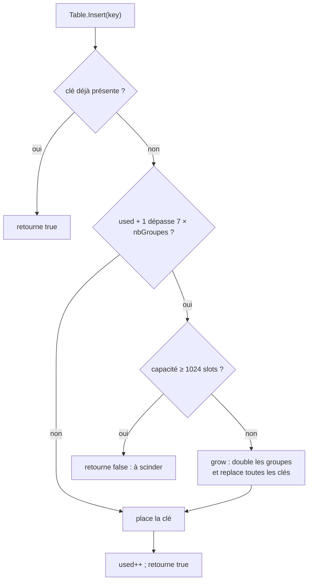
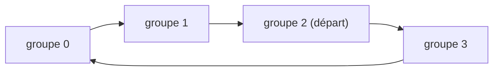
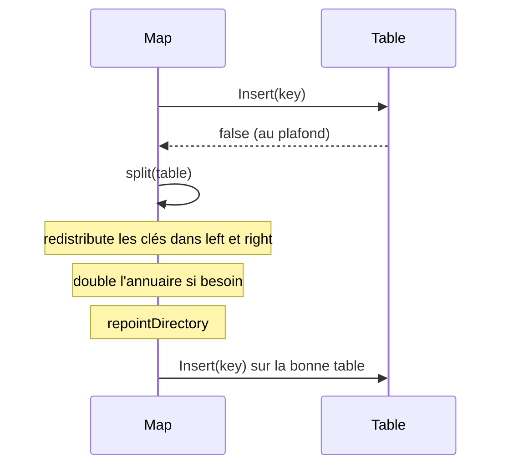
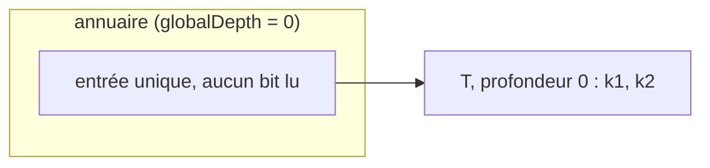
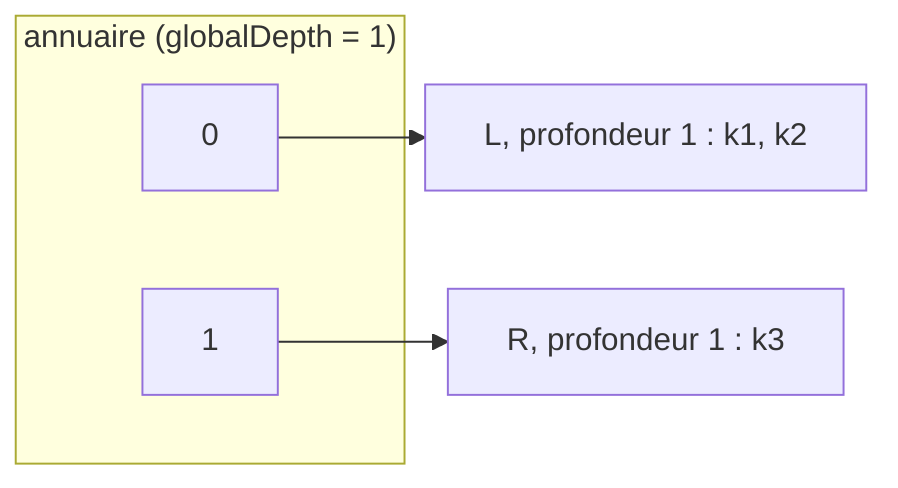
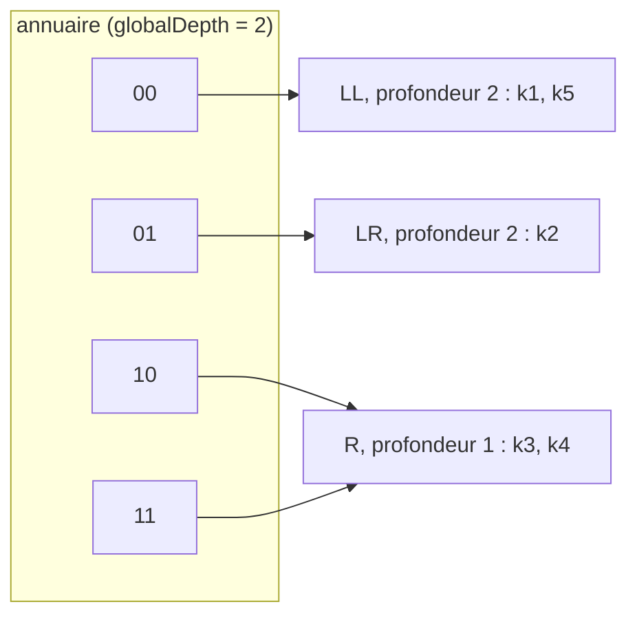
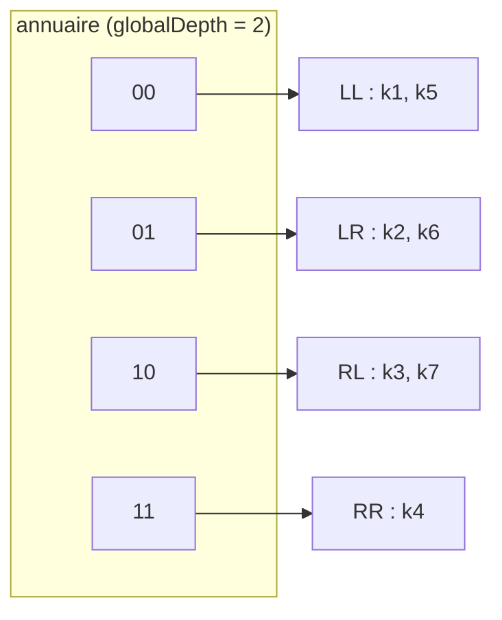

# Article 2 : quand la map grossit

Ce dossier contient les benchmarks de l'article (voir le [README racine](../README.md)). Ce document explique
en plus comment la croissance d'une Swiss Table fonctionne, à partir de notre réimplémentation pédagogique dans
[`article1/swisstable`](../article1/swisstable).

> Ce n'est pas le code du runtime. Les formules `h1`, `h2` et les constantes sont recopiées de
> `internal/runtime/maps` (Go 1.27.1), le reste est simplifié pour rester lisible. Le runtime est plus rapide
> (comparaison des 8 octets de contrôle en une opération) et plus complet (suppression, itération).

## Vue d'ensemble

La croissance se fait en deux niveaux :

1. Une **table** double sur place, jusqu'à 1024 slots.
2. Au-delà, elle **se scinde en deux**. Un **annuaire** indexé par les premiers bits du hash route chaque clé vers sa
   table.



| Fichier | Rôle |
|---|---|
| `swisstable.go` | `Group` : 8 slots, `h1`, `h2`, `Insert`, `Lookup` |
| `table.go` | `Table` : tableau de groupes, sondage, doublement sur place |
| `map.go` | `Map` : annuaire, scission d'une table pleine |

## 1. Le hash est découpé en deux

Un hash de 64 bits sert à deux choses :

- `h1` : les 57 bits hauts. Ils donnent le numéro du groupe où commencer la recherche.
- `h2` : les 7 bits bas. Ils servent de filtre rapide dans l'octet de contrôle d'un slot.

```
hash (64 bits) :  [ ......... h1 : 57 bits ......... ][ h2 : 7 bits ]
```

L'annuaire de `Map`, lui, lit les bits de poids fort du hash (`topBits`). Une table n'utilise donc jamais ces bits
pour répartir ses clés entre groupes : ils sont déjà identiques pour toutes ses clés.

## 2. Un groupe

Un groupe contient 8 slots. Chaque slot a un octet de contrôle (`ctrl`) et une clé (`keys`).



Un octet de contrôle vaut soit `ctrlEmpty`, soit `ctrlDeleted`, soit un `h2` (0 à 127, bit de poids fort à 0).

**`Insert`** pose la clé dans le premier slot libre et y écrit son `h2`. Il renvoie `false` si les 8 slots sont pris.

**`Lookup`** travaille en deux temps :

1. `MatchH2` garde les slots dont l'octet de contrôle égale `h2(hash)`. Ce sont des candidats.
2. Chaque candidat est confirmé en comparant la clé complète.

`h2` n'a que 7 bits : deux clés différentes ont 1 chance sur 128 d'avoir le même. Le filtre peut laisser passer
une mauvaise clé, jamais rejeter la bonne. Pour une clé absente, la comparaison de chaînes n'a presque jamais lieu.

## 3. Choisir le groupe de départ

```go
func GroupFor(hash uint64, groupCount uint64) uint64 {
    return h1(hash) & (groupCount - 1)
}
```

Quand `groupCount` est une puissance de 2, `x & (groupCount-1)` donne `x % groupCount` sans division.
Avec 8 groupes, le masque est `0b111` : `h1 = ...1101` donne le groupe 5.

Le nombre de groupes change quand la table grossit, donc le groupe d'une clé change aussi.
C'est pourquoi `grow` replace chaque clé au lieu de copier les groupes.

## 4. Premier niveau : la table double sur place

Une table accepte au plus `7 × nbGroupes` clés (facteur de charge de 7/8, comme dans le runtime). Il reste
toujours des slots vides, ce qui garantit que le sondage se termine.



| Groupes | Slots | Seuil | À l'insertion suivante |
|---|---|---|---|
| 1 | 8 | 7 | la 8e clé double la table (2 groupes) |
| 2 | 16 | 14 | la 15e clé double la table (4 groupes) |
| 128 | 1024 | 896 | la 897e clé : `Insert` renvoie `false` |

### Le sondage

`place` et `Contains` parcourent les groupes avec `Table.probe(hash)`. Il part de `GroupFor` puis passe au groupe
suivant, en rebouclant en fin de table.



`Contains` s'arrête au premier groupe qui a encore un slot vide : si la clé avait été insérée, elle aurait été
placée avant ce groupe.

## 5. Deuxième niveau : l'annuaire et la scission

Une table de 1024 slots ne grossit plus. La `Map` ajoute un annuaire, un tableau de pointeurs vers des tables.

- `globalDepth` : le nombre de bits de poids fort que lit l'annuaire. Il a `2^globalDepth` entrées.
- `localDepth` : le nombre de bits que distingue une table. Elle est visée par
  `2^(globalDepth - localDepth)` entrées. On a toujours `localDepth ≤ globalDepth`.

Le grand avantage : une scission ne recopie que 1024 slots au maximum, et les autres tables ne bougent pas.

### Le déroulé de `Map.Insert`



`Map.Insert` boucle : `for !table.Insert(key) { split(table) }`. Si toutes les clés sont allées du même côté,
la table visée est encore pleine, et on scinde de nouveau.

### Les trois étapes de `split`

1. **`redistribute`** : crée `left` et `right`, de profondeur `localDepth + 1`, et répartit les clés d'après le bit
   de rang `depth` du hash (`goesRight`).
2. **Doublement** : si `depth > globalDepth`, l'annuaire double (`directoryTooShallowFor`).
3. **`repointDirectory`** : les entrées qui visaient la table pleine visent désormais `left` ou `right`, d'après le
   même bit de leur index (`entryGoesRight`).

### Pourquoi doubler l'annuaire, et quand

L'annuaire ne peut aiguiller que sur les bits qu'il lit.

- **`depth ≤ globalDepth`** : il lit déjà le bit qui sépare `left` de `right`. La table était visée par
  plusieurs entrées, on les répartit. Pas de doublement.
- **`depth > globalDepth`** : la table n'avait qu'une seule entrée (`localDepth == globalDepth`). Il n'y a pas de
  place pour deux tables, donc l'annuaire double. Le doublement duplique seulement des pointeurs :
  `[A, B]` devient `[A, A, B, B]`, et aucune clé ne bouge.

## 6. Exemple complet

Pour que l'exemple tienne à l'écran, les hashs sont réduits à leurs 4 bits de poids fort et une table n'accepte
que **2 clés** (dans le code, 896).

| Clé | k1 | k2 | k3 | k4 | k5 | k6 | k7 |
|---|---|---|---|---|---|---|---|
| Hash | `0001` | `0110` | `1010` | `1101` | `0011` | `0100` | `1001` |

### k1, k2 : une seule table

`globalDepth = 0`, l'annuaire a une entrée. `T = {k1, k2}` est pleine.



### k3 (`1010`) : scission avec doublement

`T` est pleine. `depth = 1 > globalDepth = 0` : l'annuaire double. Le bit 1 sépare `k1`, `k2` (0) de `k3` (1).



`k4` (`1101`) va aussi dans `R`, qui contient maintenant `{k3, k4}` : elle est pleine.

### k5 (`0011`) : `L` est pleine, nouvelle scission avec doublement

`depth = 2 > globalDepth = 1` : l'annuaire double. Le bit 2 sépare `k1` (`0001`, bit à 0) de `k2` (`0110`, bit à 1).
`R` ne bouge pas, mais elle est désormais visée par deux entrées.



`k5` (`0011`) arrive dans `LL`. Puis `k6` (`0100`) arrive dans `LR`, qui contient `{k2, k6}`.

### k7 (`1001`) : `R` est pleine, scission sans doublement

`depth = 2` n'est pas supérieur à `globalDepth = 2` : l'annuaire a déjà deux entrées pour `R`.
Le bit 2 sépare `k3` (`1010`, bit à 0) de `k4` (`1101`, bit à 1).



### À retenir

- Les doublements (`k3`, `k5`) viennent d'une table visée par une seule entrée.
- La scission de `R` (`k7`) n'a pas doublé l'annuaire : `R` avait deux entrées.
- Une clé n'est jamais déplacée hors de la table qu'on scinde. Les autres tables restent en place.

## 7. Limites

- L'annuaire n'a pas de plafond explicite. En pratique il reste petit : environ 16 Mio pour un milliard de clés
  (une entrée de 8 octets par table, et une table pour 700 clés environ).
- Si plus de 896 clés avaient exactement le même hash sur 64 bits, `Map.Insert` scinderait en boucle. Avec la graine
  aléatoire de `maphash`, ce cas est négligeable.
- `Map` n'est pas sûre pour un usage concurrent, comme la map du runtime.
- Il n'y a pas de suppression : `ctrlDeleted` n'est jamais posé par ce code.

## Lancer les tests

```bash
go test ./article1/swisstable/... -race
```

Les tests de la croissance sont dans `table_test.go` et `map_test.go`.
